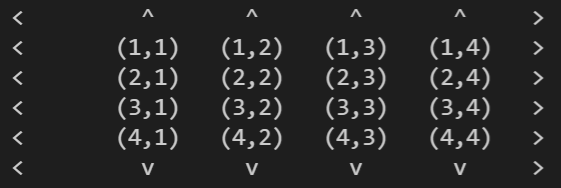

# Exercise

Hallo Leute!

Willkommen bei der nächsten Programmier-Übung in diesem Kurs.

## Aufgaben der Programmierübung

- Implementiere eine verschachtelte For-Schleife, um folgenden Konsolen-Output zu generieren.

- Linker Pfeil (< - kleiner Symbol)
- Rechter Pfeil (> - größer Symbol)
- Pfeil nach Oben (^ - Zirkumflex)
- Pfeil nach Unten (v - der Buchstabe)
