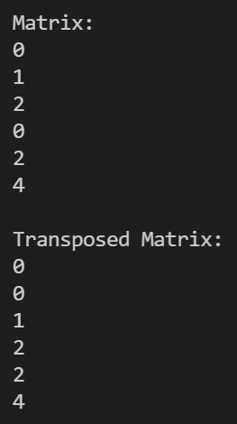

# Exercise

Hallo Leute!

Willkommen bei der nächsten Programmier-Übung in diesem Kurs.

## Aufgaben der Programmierübung

In dieser Übung werden wir eine Transponierte-Matrix "berechnen".  
Wenn ihr gar keine Ahnung habt was das ist, ist das für den weiteren Verlauf des Kurses nicht schlimm.  
Dies ist nur ein weiteres Beispiel, wofür man 2d-Arrays verwenden kann.

- Programmiere eine Funktion, die zu einer Input Matrix (2d-Array), die transponierte Matrix zurückgeben (auch 2d-Array)

Matrix M:  
  [[0, 1, 2],  
   [0, 2, 4]]  

Matrix M_Transposed:  
  [[0, 0],  
   [1, 2],  
   [2, 4]]  

Der aktuelle printMatrix Aufruf würde das ausgeben:  

## Hinweise

Was ist eine Transponierte Matrix? <https://de.wikipedia.org/wiki/Transponierte_Matrix>
