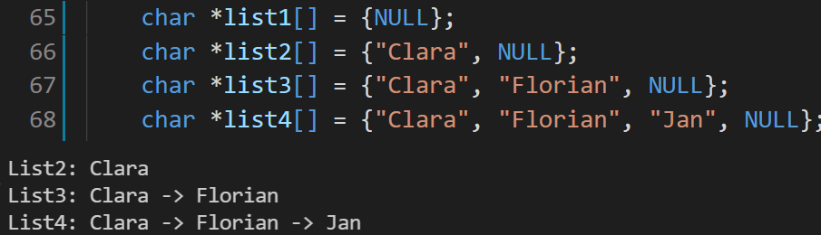

# Exercise

Hallo Leute!

Willkommen bei der nächsten Programmier-Übung in diesem Kurs.

## Aufgaben der Programmierübung

- Implementiere die "join" Funktion
  - Die Join Funktion nimmt ein **delimiter** (**char\***) und eine liste an strings **list** (**char\*\***) entgegen
  - In der Funktion werden alle Strings aus der **list** konkateniert, aber im Gegensatz zu dem normalen Konkatenieren, wird zischen den Teilwörtern der **delimiter** hineingepackt

### Beispiel

Also beim 2. Beispiel wird *Clara* und *Florian* wird zuerst der delimiter *->* an Clara konkateniert, danach dann *Florian*.
