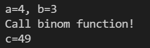

# Exercise

Hallo Leute!

Willkommen bei der nächsten Programmier-Übung in diesem Kurs.

## Aufgaben der Programmierübung

- Erstelle eine Funktion mit dem Namen "binom"
- Diese bekommt per Call by Reference die beiden Variablen int a und int b übergeben
- Die Funktion soll die erste Binomische Formel berechnen: (a+b)^2 und das Ergebnis dieser Formel soll returned werden

## Beispiel

## Hinweise

Der Udemy Compiler überprüft nur, ob ihr eine Lösung abgegeben habt.Meine Musterlösung werde ich im folgenden Video vorstellen.
